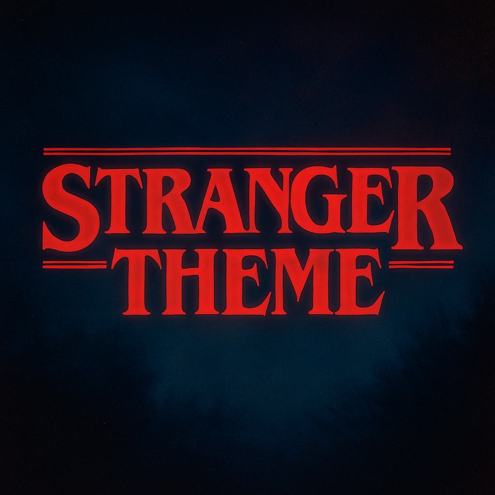

<div align="center">



</div>

# Stranger Theme for Vim/Neovim

> 🔦 A dark colorscheme collection inspired by Stranger Things

## Install

#### Using vim-plug

```vim
Plug 'stranger-theme/stranger-theme', { 'rtp': 'vim' }
```

#### Using packer.nvim (Neovim)

```lua
use { 'stranger-theme/stranger-theme', rtp = 'vim' }
```

#### Using lazy.nvim (Neovim)

```lua
{
  'stranger-theme/stranger-theme',
  config = function()
    vim.cmd('colorscheme stranger_starcourt')
  end,
}
```

#### Manual Installation

```bash
# Vim
mkdir -p ~/.vim/colors
cp colors/*.vim ~/.vim/colors/

# Neovim
mkdir -p ~/.config/nvim/colors
cp colors/*.vim ~/.config/nvim/colors/
```

## Activate

Add to your `.vimrc` or `init.vim`:

```vim
set termguicolors
colorscheme stranger_starcourt
```

Or in Neovim `init.lua`:

```lua
vim.opt.termguicolors = true
vim.cmd('colorscheme stranger_starcourt')
```

## Theme Variants

- `stranger_upside_down` - Dark blue-black with desaturated tones
- `stranger_starcourt` - Vibrant 80s mall aesthetic with neon colors
- `stranger_hawkins` - Small-town America with warm, muted colors
- `stranger_the_lab` - Clinical, institutional aesthetic
- `stranger_tigers` - School colors with orange/black tones
- `stranger_dimension_x` - Dark red dimension with moody textures

## Plugin Support

Includes highlight groups for:

- Treesitter (Neovim)
- Telescope (Neovim)
- nvim-cmp (Neovim)
- NERDTree
- GitGutter

## Development

### Building from Source

```bash
npm install
npm run build    # Generates colorschemes from shared palettes
```

## Contributing

Contributions are welcome! See the main repository's [Contributing Guide](../stranger-theme/CONTRIBUTING.md).

## Team

This theme is maintained by [@tcvieira](https://github.com/tcvieira) and [contributors](https://github.com/stranger-theme/stranger-theme/graphs/contributors).

## License

[MIT License](./LICENSE) © Stranger Theme
